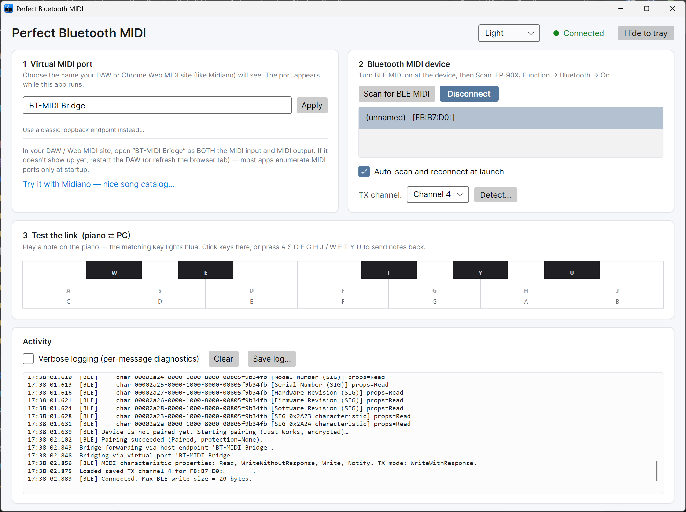

# Perfect Bluetooth MIDI For Windows

A tiny Windows app that lets **any** program on your PC — DAWs, Chrome sites
using Web MIDI, like [Midiano](https://app.midiano.com/) —
talk to a **Bluetooth LE MIDI** device (Roland FP-90X, WIDI Master, CME,
Yamaha MD-BT01, …) as if it were a normal wired MIDI device.



## Why this exists

The new **Windows MIDI Services** stack (replaces the WinMM MIDI 1.0 plumbing
in recent Windows 11 builds) does not yet provide a native BLE-MIDI
transport. Until it does, this app fills the gap by piping data between a
real BLE-MIDI device and a Windows MIDI Services endpoint your DAW or
browser attaches to.

```
 ┌─────────────────┐   BLE GATT   ┌──────────────┐  UMP / WinMM   ┌──────────────────┐
 │  BLE-MIDI       │ <──────────> │  the bridge  │ <───────────>  │ DAW / Web MIDI / │
 │  device         │              │  (this app)  │                │ MIDI-OX / etc.   │
 └─────────────────┘              └──────────────┘                └──────────────────┘
```

The bridge picks one of two host-side surfaces automatically:

- **Virtual MIDI port** (preferred) — declared on the fly via the new WMS
  App SDK. You just type the name your DAW will see; the port lives only
  while this app runs. Requires the WMS App SDK Runtime to be installed
  (one-time download, see [Setup](#one-time-setup)). Recommended by Microsoft
  for app-to-app MIDI bridging.

- **Classic loopback endpoint** (fallback) — for users who don't have the
  SDK Runtime installed. You create a Windows MIDI Services loopback once
  in MIDI Settings, and the app pipes through it.

## Highlights

- **Single-file ~22 MB exe** — no installer, no prerequisites. Self-contained
  + trimmed + compressed: the .NET 10 runtime is bundled, so it runs on a PC
  with no .NET installed at all.
- **Genuinely portable** — everything the app writes goes into a
  `PerfectBluetoothMidi.data` folder next to the exe: settings, per-device
  settings, crash log. Keep the exe and that folder together on a USB stick
  and your setup travels with you; delete both and nothing is left behind.
  (If the exe lives somewhere read-only such as `Program Files`, it falls
  back to `%AppData%\PerfectBluetoothMidi` and says so in the log.)
- **Zero-setup virtual port** when the WMS App SDK Runtime is installed —
  no MIDI Settings dance, no `midi loopback create`. Just type a name
  ("BT-MIDI Bridge" by default), and your DAW sees a port with that name
  for as long as this app is running. Edit the name and click **Apply**
  while connected — the app disconnects, renames, and reconnects on its
  own; you don't lose the BLE link.
- **Auto-fallback** to the legacy loopback flow if the SDK Runtime isn't
  present. Switch between backends in-app at any time (the link in card 1
  takes care of the disconnect / reconnect cycle for you).
- **Auto-scan and reconnect at launch** (on by default). Quit the app
  while connected and the next launch picks the same device back up as
  soon as it advertises — no clicks needed.
- **Per-device TX channel selector** + auto-detector. Some BLE-MIDI devices
  (Roland FP-90X observed) silently receive on a channel that's *different*
  from their visible "Transmit Channel" setting. Click **Detect…** and the
  app plays *N* ascending notes on each channel 1..16 — the count you hear
  tells you the device's receive channel. Saved per BLE MAC so you only do
  this once per piano.
- **On-screen piano** for quick two-way testing without a DAW. The
  highlight-on-remote-keypress feedback is live — play a key on the real
  piano, the matching on-screen key lights up.
- **Headless CLI mode** for scripted tests: `--scan`, `--connect`,
  `--detect-channels`, `--phase N`, `--channels "1-8"`, `--verbose`, `--log`.
- **Verbose BLE/MIDI diagnostics** at the flick of a checkbox — status-byte
  names + hex dumps for every message in both directions, including on-connect
  GATT service/characteristic enumeration.
- **Settings menu (⚙)** at the top-right (left of the connection status)
  holds the light / dark / system theme picker, the **Start minimised to the
  system tray** option and the update preferences.
- **Automatic updates** — checks GitHub for new releases (**Monthly** by
  default; also Daily / Weekly / Never, plus a **Check now** button) and
  installs them in one click: downloads the new exe, verifies its SHA-256
  against the release checksum, swaps itself in place, and relaunches. Set the
  cadence to **Never** to turn it off. See [Automatic updates](#automatic-updates).
- **Hide-to-tray** keeps the bridge running in the background. Closing the
  window cleanly unpairs the device on exit so it's released for other
  hosts (phone apps, another PC) rather than stuck bonded to Windows.
- **Runs at login, invisibly** — tick **Start minimised to the system tray**
  in ⚙ Settings (off by default) and drop the app in your Startup folder.
  Combined with auto-reconnect it comes up at login, picks your device back
  up and stays out of the way. Click the tray icon to show the window.

## Download

Grab the latest `PerfectBluetoothMidi.exe` from the
[**Releases page**](../../releases). Single ~22 MB file — put it anywhere
and double-click. Nothing else to install: the .NET runtime is bundled
inside the exe.

On first run it creates a `PerfectBluetoothMidi.data` folder alongside
itself for your settings and logs. That folder plus the exe **is** the whole
installation: copy both to move it, delete both to uninstall. Nothing is
written to the registry, and (unless the exe is somewhere read-only) nothing
is left in `%AppData%`. Upgrading in place keeps your settings, since the
updater only replaces the exe.

## One-time setup

### Recommended: install the WMS App SDK Runtime (skips the loopback step)

If you install the **Windows MIDI Services App SDK Runtime and Tools**,
this app can declare its own MIDI port on demand — no loopback to create,
no MIDI Settings dance, no `midi loopback create`. Just launch the app and
your DAW sees the port.

1. Go to [aka.ms/midi](https://aka.ms/midi) to grab the latest
   "Windows MIDI Services SDK Runtime and Tools" `.exe` for your
   architecture (x64 for Intel/AMD, Arm64 for Qualcomm), and run it.
   Windows 11 UAC will prompt for admin rights during install.
2. Launch this app. Card 1 will say **"Virtual MIDI port"**. Type whatever
   name you want your DAW to see (default: `BT-MIDI Bridge`), click
   **Apply**, and you're done.
3. Skip to [Using it](#using-it).

### Alternative: classic loopback endpoint (no SDK runtime needed)

If you don't want to install the SDK Runtime, the app falls back
automatically to the legacy loopback flow. The Windows MIDI Services
*service* itself ships in-box with recent Windows 11 updates (24H2 / 25H2 /
26H1), so this path works on a stock install — you just have to create the
loopback yourself once.

**Verify WMS service is present:**

```
midi --version
```

If `midi` is not recognised, you don't have the WMS console tool installed
either — pick the recommended path above, which gives you `midi` along with
the SDK runtime.

**Create a loopback endpoint:**

WMS supports two loopback flavours; either works with this app. Pick
whichever's easier:

- **MIDI 2.0 UMP pair (default):** *GUI:* MIDI Settings → **Loopback /
  Endpoints** → **Create loopback pair**, root name `BT-MIDI Bridge`. You'll
  get `BT-MIDI Bridge (A)` and `BT-MIDI Bridge (B)`. *Console:*
  `midi loopback create --root-name "BT-MIDI Bridge"`. This app uses the
  **A** side; your DAW picks **B**.
- **MIDI 1.0 "BLOOP" (single endpoint, like loopMIDI):** install the
  "MIDI 1.0 Basic Loopback" service plugin from WMS releases, create one
  from MIDI Settings named `BT-MIDI Bridge`. App and DAW both pick the same
  endpoint.

(The app will offer to run `midi loopback create` automatically on first
launch when no loopback exists.)

## Using it

### With the virtual-port backend (SDK Runtime installed)

1. Launch `PerfectBluetoothMidi.exe`.

2. **Confirm the port name** in card 1 (default: `BT-MIDI Bridge`). Edit it
   if you'd like, click **Apply**.

3. **Put the BLE device into advertising mode**, then click **Scan for BLE
   MIDI**.
   - **Roland FP-90X**: press **[Function]**, select **Bluetooth**, set
     **Bluetooth On/Off** to **On**. The piano advertises while this screen
     is open.
   - **WIDI Master / Yamaha MD-BT01 / CME**: power on — they advertise
     automatically.

4. Your device appears in the list within a few seconds. Select it and
   click **Connect**. First connect also pairs (Just Works, encrypted);
   subsequent connects are instant.

5. **(FP-90X and similar)** The first time you connect, click **Detect…**
   next to the TX channel dropdown. The app plays 1 note on ch1, 2 on ch2,
   … 16 on ch16, with 3 s gaps. Exactly one burst will sound on the piano;
   the number of notes equals the piano's receive channel. Pick that number
   in the dropdown — it's saved per device, so you won't do this again.

6. In your DAW / Web MIDI site, open the port by the name you chose as
   BOTH input and output. (The card 1 hint shows the exact name.)

> **Tip — restart your DAW or browser tab if you don't see the port yet.**
> Most MIDI hosts enumerate available ports once at startup, so a port
> that appears *after* the host launched won't show up until you restart
> it (or refresh the browser tab for Web MIDI sites). After you've done
> that once, leave this app running and the port stays visible across
> normal connect/disconnect cycles.

### With the classic-loopback backend (fallback)

Same steps, but in step 2 you pick the loopback endpoint from a dropdown
instead of typing a name. In step 6 the DAW picks the *opposite* side of
the pair (UMP pair: `BT-MIDI Bridge (B)` if the app picked `(A)`; BLOOP:
the same name as the app picked). Same restart-the-DAW caveat applies
the first time you set it up.

### Auto-reconnect at launch

Section 2 has an **Auto-scan and reconnect at launch** checkbox (on by
default). When ticked, the next time you open the app it scans for the
last device you connected to and reconnects automatically as soon as it
sees an advertisement. If the device isn't powered on or in range, the
scan times out silently and you can use the normal manual flow. Untick
the box if you'd rather always pick the device manually.

### Switching backends without dropping the BLE link

Card 1 shows a *"Use a classic loopback endpoint instead…"* link in
virtual mode (or *"Use a virtual MIDI port instead…"* in loopback mode,
when the SDK Runtime is detected). Clicking it does the full disconnect
→ swap → reconnect cycle for you — your BLE device stays paired and the
session resumes on the new backend. Same thing happens when you change
the virtual port name and click **Apply** while connected.

Closing the window exits the app. Click **Hide to tray** if you want the
bridge to keep running in the background — bring the window back (or exit
properly) from the tray icon's right-click menu.

### Automatic updates

The app keeps itself up to date straight from its GitHub
[Releases](../../releases) — there's no installer and no separate updater
process to manage.

- **Pick how often it checks.** Open the **⚙ Settings** menu (gear icon at the
  top-right, just left of the connection status) and choose a cadence under
  **Check for updates**: **Never**, **Daily**, **Weekly**, or **Monthly** (the
  default). The check runs quietly in the background a moment after launch once
  that interval has elapsed — it never blocks startup or interrupts playing.
- **Check on demand.** The same menu has a **Check now** button to look
  immediately, whatever the cadence is set to.
- **You're always asked first.** When a newer version exists you get a prompt
  showing the new version number and its release notes, with three choices:
  **Install and restart**, **Skip this version** (it won't auto-prompt for
  that specific version again), or **Later**. Nothing is downloaded or changed
  until you choose *Install*.
- **What installing does.** It downloads the new `PerfectBluetoothMidi.exe`,
  **verifies it against the release's published SHA-256 checksum** over HTTPS,
  replaces the running exe in place, and relaunches into the new version. Your
  BLE device is released cleanly first, so the new instance reconnects on its
  own. If the app's folder isn't writable (for example it's in a protected
  location like *Program Files*), it skips the in-place swap and just opens the
  download page so you can replace it manually.
- **Turning it off.** Set the cadence to **Never** and the background check
  stops entirely. (The **Check now** button still works if you ever want to
  look manually.)

> Updates only flow *forward from a build that has this feature*. The first
> release that includes the updater is **v1.5.0** — install that one manually
> from the Releases page, and every release after it can update automatically.

## A great way to try it out

[**Midiano**](https://app.midiano.com/) is a beautiful Chrome Web MIDI app
with a nice catalog of songs that play themselves on your
piano through the bridge. Open it, pick the opposite-side loopback
endpoint (see the "DAW should use" hint in the app's card 1) as the MIDI
output, and hit play on any song — your piano plays it.

## Headless / CLI mode

Any recognised CLI flag skips the GUI and runs headless. Useful for
scripting and debugging.

```
PerfectBluetoothMidi.exe --scan [--scan-time SEC] [--log PATH]
PerfectBluetoothMidi.exe --connect ADDR [options] [--log PATH]
PerfectBluetoothMidi.exe --help
```

`ADDR` is a BLE MAC — `98:8B:0A:12:34:56`, `98-8B-0A-12-34-56`, or
`988B0A123456`.

Notable `--connect` options:

| Flag | What it does |
|---|---|
| `--detect-channels` | Play N ascending notes on each channel 1..16 (3 s gaps). Count the notes you hear = device receive channel. |
| `--channel N` | Send on channel N for phases 1..4, 6, 7 (default 1). |
| `--channels "1-8"` | For phase 5 (channel sweep), play only these channels. Supports lists: `"1,3,5"` or ranges: `"1-4,9-12"`. |
| `--phase N` | Run only phase N of the built-in test sequence (1..7). Default runs all 7. |
| `--wake-up` | Send CC7=127, CC121=0, CC123=0, PC0 on ch1 before the test. |
| `--active-sensing` | Send 0xFE every 250 ms in background during the test. |
| `--verbose`, `-v` | Per-message BLE trace (default ON in CLI). |
| `--quiet`, `-q` | Suppress per-message trace. |
| `--log PATH` | Also write stamped log to PATH (stdout still used). |

Test-sequence phases:

1. C major scale ascending on ch1
2. C major scale descending on ch1
3. C major arpeggio on ch1
4. Chord progression C → F → G → C on ch1
5. Middle-C sweep across channels 1..16 (*the* channel-debug phase)
6. Fast trill C4↔D4 on ch1
7. Big C major 9 chord on ch1 at velocity 120

## Compatibility

- **Windows 11** with Windows MIDI Services installed.
- **Classic MIDI apps** (WinMM): all DAWs, MIDI-OX, FL Studio, Reaper,
  Cubase, Studio One, Ableton Live, etc. WMS transparently replumbs the old
  WinMM API through the new service, so every WinMM app sees loopback
  endpoints without modification.
- **Chrome Web MIDI**: Chromium's MIDI backend on Windows uses the WinRT
  MIDI 1.0 API, also replumbed through WMS.
- **Edge / Opera / Brave / Arc**: Chromium-based, same as Chrome.
- **Firefox**: does not ship Web MIDI. Not this app's limitation.

## Troubleshooting

- **The app closes immediately when you launch it, with no error.** That
  usually means something took the process down before it could report
  anything. Relaunch it once: startup leaves a breadcrumb behind, so the
  next run names the phase that died and writes it to the log. If the
  culprit was the Windows MIDI Services SDK, the app skips it automatically
  and starts on the loopback backend instead. You can force that by hand
  with `PerfectBluetoothMidi.exe --no-wms`, and undo it with `--wms`. For a
  full trace to attach to a bug report, run
  `PerfectBluetoothMidi.exe --log C:\pbm.txt --verbose`.

- **The port doesn't appear in my DAW / amp sim / browser.** Two causes, in
  order of likelihood:
  1. **The app wasn't running when the other program started.** Almost every
     DAW and plugin host looks for MIDI ports once, at launch. Start this app
     first, then fully quit and reopen the DAW (closing its settings window
     isn't enough).
  2. **An older virtual MIDI driver is in the way.** `loopMIDI` in particular
     has been observed to stop Windows MIDI Services ports from reaching
     applications: the DAW listed other endpoints but never `BT-MIDI Bridge`,
     and uninstalling loopMIDI plus a reboot made it appear
     ([#3](../../issues/3)). You don't need loopMIDI for this app — it creates
     its own port — so remove it if it's only there for this.

- **The status says "Disconnected" and no MIDI flows.** Finding your device in
  the list isn't the last step: select it and click **Connect**. A device
  labelled `(paired to Windows)` is paired with *Windows*, which is not the
  same as this app holding the link. The pill turns green when it's actually
  bridging.

- **Where are my settings / the crash log?** In the
  `PerfectBluetoothMidi.data` folder next to the exe. If the exe is
  somewhere read-only such as `Program Files`, they go to
  `%AppData%\PerfectBluetoothMidi` instead; the startup log says which.

- **The app says "WMS App SDK runtime not detected".** That's expected if
  you haven't installed the Windows MIDI Services SDK Runtime — the app
  silently falls back to the loopback path. Either follow the [classic
  loopback setup](#alternative-classic-loopback-endpoint-no-sdk-runtime-needed)
  or install the SDK Runtime and Tools from
  [aka.ms/midi](https://aka.ms/midi).

- **"No loopback endpoint pairs found."** Loopback path only — no loopback
  exists yet. Run `midi loopback create --root-name "BT-MIDI Bridge"` (UMP
  pair), or use MIDI Settings to create a UMP pair or BLOOP, then
  **Refresh** in the app.

- **Scan shows no devices.** Make sure Windows Bluetooth is on, and that
  the device is advertising (for FP-90X: advertises only while its
  Bluetooth settings screen is open). Normal user account; no admin
  required.

- **Connect fails with "MIDI service not found".** Some devices stop
  advertising once Windows's own pairing dialog pops up. Close Windows
  Settings, click **Scan** again, then **Connect** immediately.

- **BLE writes return Success but no sound.** 99% of the time it's the
  receive-channel quirk — click **Detect…** and pick the right channel.
  If detect also produces no sound, check the piano's master volume, MIDI
  Input Volume (if it has one), and that it isn't in a demo / split mode
  that routes audio somewhere unusual.

- **Audio delay / latency.** BLE MIDI has ~10 ms of inherent latency
  (that's why the spec carries a 13-bit ms timestamp). The bridge itself
  adds well under 1 ms. Anything past 20 ms is your DAW's audio buffer,
  not this app.

- **Something weird is happening and you want to see every MIDI byte.**
  Tick **Verbose logging** in the Activity panel. The log then shows the
  status-byte name (NoteOn / CC / SysEx / …) and raw hex for every message
  in both directions, plus the full GATT service/characteristic tree on
  connect. **Save log…** writes the current log to a file.

## Build from source

```
winget install Microsoft.DotNet.SDK.10
git clone https://github.com/mayerwin/Perfect-Bluetooth-MIDI-For-Windows.git
cd Perfect-Bluetooth-MIDI-For-Windows
.\BUILD.bat
# output: dist\PerfectBluetoothMidi.exe
```

Or open `PerfectBluetoothMidi.sln` in Visual Studio 2026 and **Publish**
(target `win-x64`, self-contained, single file).

The built-in [self-updater](#automatic-updates) is enabled by default. To
produce a build **without** it — e.g. for the Microsoft Store, which delivers
its own updates and disallows apps that self-update — publish with
`-p:EnableSelfUpdate=false`. That strips the updater code and its UI at compile
time (the ⚙ Settings menu then shows only the theme picker).

### Source layout

```
PerfectBluetoothMidi/
├── PerfectBluetoothMidi.csproj  # .NET 10 + Avalonia 11, self-contained single-file publish
├── app.manifest              # Win10/11 compat + per-monitor DPI awareness
├── Program.cs                # entry point + CLI-vs-GUI branch
├── CliHost.cs                # headless CLI (scan / connect / detect / phase)
├── MainWindow.axaml(.cs)     # main GUI window + backend selection
├── PianoKeyboard.cs          # custom Avalonia on-screen keyboard control
├── Bridge.cs                 # glue: BLE ⇄ IHostMidiEndpoint
├── IHostMidiEndpoint.cs      # interface — the host side of the bridge
├── WinMMHostEndpoint.cs      # legacy backend (WMS loopback via WinMM)
├── WmsVirtualHostEndpoint.cs # preferred backend (WMS App SDK virtual UMP device)
├── WmsRuntime.cs             # SDK init/detection + UMP ⇄ MIDI 1.0 helpers
├── BleMidiClient.cs          # BLE GATT client + TransmitChannel rewrite
├── BleMidiParser.cs          # BLE-MIDI 1.0 framing: decode + encode
├── ChannelDetector.cs        # N-notes-per-channel auto-detector
├── DeviceSettings.cs         # per-MAC persistence
├── AppSettings.cs            # global settings (theme, backend, virtual port name, update cadence)
├── UpdateService.cs          # self-updater (GitHub releases → SHA-256 → in-place swap); SELF_UPDATE-gated
├── WinMMMidi.cs              # P/Invoke wrapper for midiIn*/midiOut* (WMS-replumbed)
└── Diag.cs                   # shared verbose-logging flag + hex helpers
```

External NuGet packages: Avalonia 11, plus `Microsoft.Windows.Devices.Midi2`
(the WMS App SDK projection). The latter is **not on nuget.org** — it's
vendored from the [Microsoft MIDI GitHub releases](https://github.com/microsoft/MIDI/releases)
into `nuget-packages/` and surfaced via a local `<add>` source in
`NuGet.config`. To update: drop the new `.nupkg` in there, bump the
`PackageReference Version` in `PerfectBluetoothMidi.csproj`, and re-run
`dotnet restore`.

## License

[MIT](LICENSE). Windows MIDI Services is Microsoft's, MIT-licensed, see
<https://github.com/microsoft/MIDI>.
